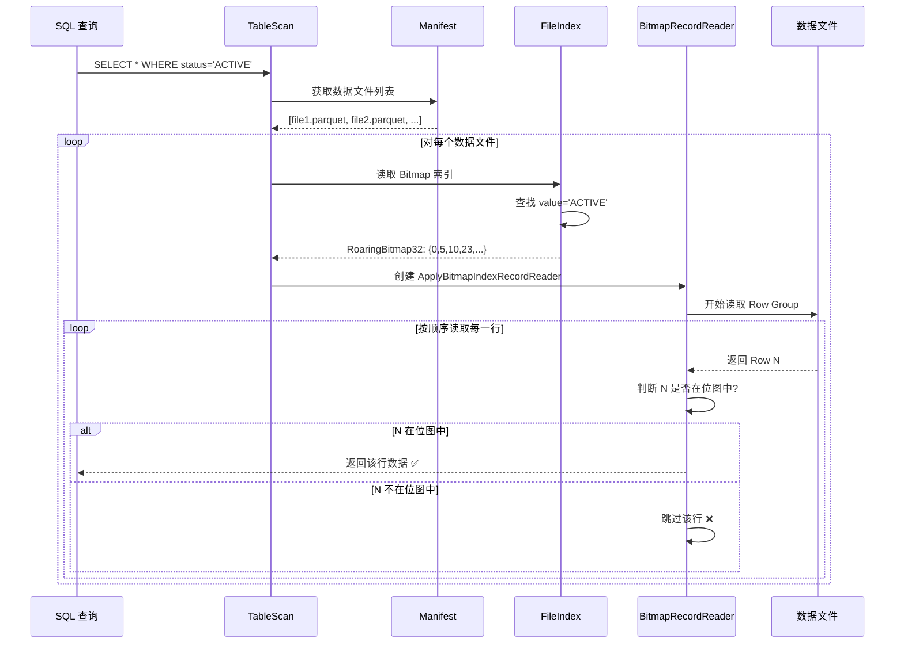
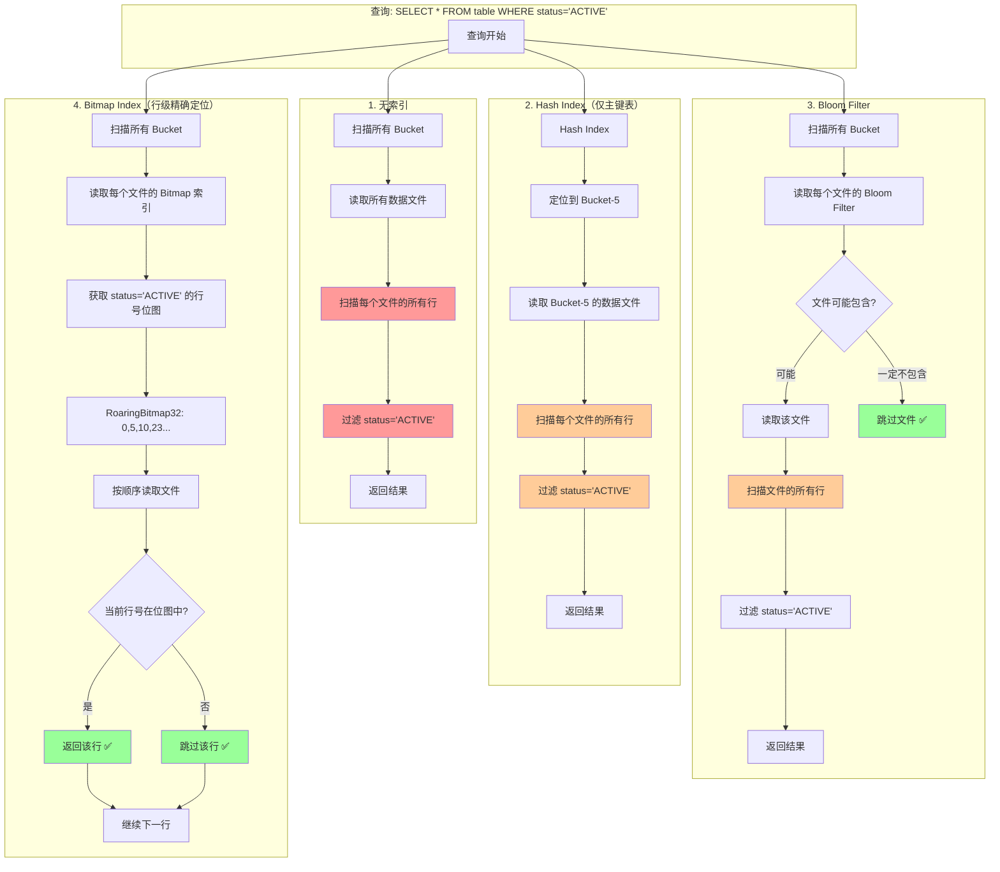

# Paimon 所有索引类型详细分析

## 目录
1. [索引分类总览](#索引分类总览)
2. [Table-Level 索引](#table-level-索引)
3. [File-Level 索引](#file-level-索引)
4. [行级精确定位能力分析](#行级精确定位能力分析)
5. [使用场景与最佳实践](#使用场景与最佳实践)

---

## 索引分类总览

Paimon 支持**两大类索引**：

### 1. Table-Level Index（表级索引）

**定位范围**：Bucket 级别

| 索引类型 | 用途 | 适用表类型 | 配置参数 |
|---------|------|-----------|---------|
| **Hash Index** | 动态分桶：hashcode → bucket 映射 | 主键表 | `bucket = -1` (默认) |
| **Deletion Vector Index** | 标记删除的行位置 | 主键表 | `deletion-vectors.enabled = true` |

### 2. File-Level Index（文件级索引）

**定位范围**：数据文件内的行级别

| 索引类型 | 原理 | 适用场景 | 配置参数 |
|---------|------|---------|---------|
| **Bloom Filter** | 概率数据结构，判断元素是否可能存在 | 点查询（等值查询） | `file-index.bloom-filter.columns` |
| **Bitmap Index** | 值 → RowID 位图映射 | 低基数列、等值/IN 查询 | `file-index.bitmap.columns` |
| **BSI (Bit-Sliced Index)** | 数值范围查询的位切片索引 | 数值列范围查询 | `file-index.bsi.columns` |
| **Range Bitmap** | 范围查询优化的位图索引 | 范围查询 | `file-index.range-bitmap.columns` |

---

## Table-Level 索引

### 1. Hash Index（已在前面文档详细分析）

**核心能力**：
- **定位到 Bucket**：通过 key.hashCode() 快速定位到 bucket
- **无法行级定位**：只能定位到 bucket 级别，仍需扫描 bucket 内的所有数据文件

**限制**：
```
SELECT * FROM table WHERE id = 3
  ↓ Hash Index
定位到 bucket-5
  ↓ 仍需扫描
bucket-5/data-file-001.parquet (全文件扫描)
bucket-5/data-file-002.parquet (全文件扫描)
...
```

### 2. Deletion Vector Index

**核心能力**：
- 标记已删除的行，避免读取已删除数据
- 结合 Bitmap 实现行级过滤

**存储格式**：
```
DeletionVectorMeta {
    fileName: String          // DV 文件名
    offset: int               // 文件内偏移量
    length: int               // DV 数据长度
    cardinality: int          // 删除的行数
}
```

---

## File-Level 索引

> **关键发现**：File-Level 索引具备**行级精确定位能力**！

### 1. Bloom Filter Index

#### 1.1 原理

**Bloom Filter** 是一种空间高效的概率数据结构，用于测试元素是否在集合中。

**特性**：
- **假阳性（False Positive）**：可能误判元素存在（实际不存在）
- **无假阴性（False Negative）**：如果判断不存在，则一定不存在
- **空间效率高**：相比存储完整值，空间占用极小

#### 1.2 存储格式

```
+------------------------+
| numHashFunctions (4B)  |  // 哈希函数数量
+------------------------+
| bit set bytes          |  // 位数组
+------------------------+
```

#### 1.3 配置示例

```sql
CREATE TABLE my_table (
    id INT,
    name STRING,
    email STRING
) WITH (
    'file-index.bloom-filter.columns' = 'email',                    -- 为 email 列创建索引
    'file-index.bloom-filter.email.fpp' = '0.01',                   -- 假阳性率 1%
    'file-index.bloom-filter.email.items' = '1000000'               -- 预期不重复值数量
);
```

#### 1.4 查询流程

```
SELECT * FROM my_table WHERE email = 'test@example.com'
  ↓
1. 扫描所有数据文件的 Bloom Filter 索引
  ↓
2. 过滤掉一定不包含该值的文件
  File-001: Bloom Filter.test('test@example.com') = false  ✅ 跳过
  File-002: Bloom Filter.test('test@example.com') = true   ⚠️ 可能包含
  File-003: Bloom Filter.test('test@example.com') = false  ✅ 跳过
  ↓
3. 只读取 File-002（仍需全文件扫描）
```

**能力边界**：
- ✅ **文件级跳过**：跳过不包含该值的文件
- ❌ **行级定位**：无法定位到具体的行，仍需扫描整个文件

#### 1.5 实现代码

```java
// 写入索引
public class Writer extends FileIndexWriter {
    private final BloomFilter64 bloomFilter;
    
    @Override
    public void write(Object key) {
        if (key != null) {
            long hash = HashFunction.hash(key);  // 计算哈希值
            bloomFilter.add(hash);               // 添加到 Bloom Filter
        }
    }
}

// 读取索引
public class Reader extends FileIndexReader {
    @Override
    public FileIndexResult visitEqual(FieldRef fieldRef, Object literal) {
        long hash = HashFunction.hash(literal);
        if (!bloomFilter.test(hash)) {
            return SKIP;  // 确定不包含，跳过文件
        }
        return REMAIN;    // 可能包含，需要读取
    }
}
```

---

### 2. Bitmap Index（重点：行级精确定位）

#### 2.1 原理

**Bitmap Index** 为每个唯一值维护一个位图（Bitmap），位图的每一位对应数据文件中的一行。

**核心能力**：
- ✅ **行级精确定位**：通过位图直接知道哪些行包含查询值
- ✅ **高效过滤**：读取数据时只读取位图标记的行

#### 2.2 存储格式（V2）

```
+------------------------------------------+
| version (1B) = 2                         |
+------------------------------------------+
| row count (4B)                           |  总行数
+------------------------------------------+
| non-null value bitmap number (4B)       |  不同值的数量
+------------------------------------------+
| has null value (1B)                      |  是否有 NULL
+------------------------------------------+
| null value offset (4B)                   |  NULL 位图偏移量
+------------------------------------------+
| null bitmap length (4B)                  |  NULL 位图长度
+------------------------------------------+
| bitmap index block number (4B)           |  索引块数量
+------------------------------------------+
| value 1 | offset 1                       |  值1 -> 位图偏移量
| value 2 | offset 2                       |  值2 -> 位图偏移量
| ...                                      |
+------------------------------------------+
| bitmap body offset (4B)                  |  位图数据起始位置
+------------------------------------------+
| RoaringBitmap32 for null (if exists)     |  NULL 值的位图
| RoaringBitmap32 for value 1              |  值1 的位图
| RoaringBitmap32 for value 2              |  值2 的位图
| ...                                      |
+------------------------------------------+
```

**RoaringBitmap32**：
- 高效压缩的位图实现
- 存储行号集合（例如：{0, 5, 10, 100, 1000}）

#### 2.3 配置示例

```sql
CREATE TABLE my_table (
    id INT,
    status STRING,    -- 低基数列，适合 Bitmap 索引
    category INT
) WITH (
    'file-index.bitmap.columns' = 'status,category'
);
```

#### 2.4 查询流程（**关键：行级过滤**）

```
SELECT * FROM my_table WHERE status = 'ACTIVE'
  ↓
1. 读取 Bitmap 索引
  value='ACTIVE' -> RoaringBitmap32: {0, 5, 10, 23, 45, 67, ...}
  ↓
2. 创建 ApplyBitmapIndexRecordReader
  ↓
3. 逐行读取数据文件，但只返回位图标记的行
  Row 0:  返回 ✅ (在位图中)
  Row 1:  跳过 ❌
  Row 2:  跳过 ❌
  Row 3:  跳过 ❌
  Row 4:  跳过 ❌
  Row 5:  返回 ✅ (在位图中)
  ...
```

#### 2.5 实现代码（**行级精确定位的关键**）

**写入索引**：

```java
public class Writer extends FileIndexWriter {
    private final Map<Object, RoaringBitmap32> id2bitmap = new HashMap<>();
    private int rowNumber = 0;
    
    @Override
    public void write(Object key) {
        if (key != null) {
            id2bitmap
                .computeIfAbsent(key, k -> new RoaringBitmap32())
                .add(rowNumber++);  // 记录当前行号
        }
    }
}
```

**读取索引并过滤行**：

```java
// ApplyBitmapIndexFileRecordIterator.java
public class ApplyBitmapIndexFileRecordIterator implements FileRecordIterator<InternalRow> {
    private final FileRecordIterator<InternalRow> iterator;
    private final RoaringBitmap32 bitmap;  // 需要返回的行号集合
    
    @Nullable
    @Override
    public InternalRow next() throws IOException {
        while (true) {
            InternalRow next = iterator.next();
            if (next == null) {
                return null;
            }
            
            int position = (int) returnedPosition();  // 当前读取的行号
            
            // ⚠️ 关键：只返回位图中标记的行
            if (bitmap.contains(position)) {
                return next;  // 该行匹配查询条件，返回
            }
            // 否则跳过，继续读取下一行
        }
    }
}
```

**查询评估器**：

```java
// FileIndexEvaluator.java
public static FileIndexResult evaluate(...) {
    // 1. 创建文件索引谓词
    try (FileIndexPredicate predicate = createFileIndexPredicate(...)) {
        // 2. 评估查询条件
        Predicate filter = PredicateBuilder.and(dataFilter.toArray(new Predicate[0]));
        FileIndexResult result = predicate.evaluate(filter);
        
        // 3. 结合 Deletion Vector 过滤已删除行
        BitmapIndexResult selection = createBaseSelection(file, dv);
        result.and(selection);
        
        // 4. 返回需要读取的行号位图
        return result;  // BitmapIndexResult
    }
}
```

#### 2.6 支持的查询类型

| 查询类型 | 是否支持 | 示例 |
|---------|---------|------|
| 等值查询 | ✅ | `WHERE status = 'ACTIVE'` |
| IN 查询 | ✅ | `WHERE status IN ('ACTIVE', 'PENDING')` |
| NOT EQUAL | ✅ | `WHERE status != 'DELETED'` |
| NOT IN | ✅ | `WHERE status NOT IN ('DELETED')` |
| IS NULL | ✅ | `WHERE status IS NULL` |
| IS NOT NULL | ✅ | `WHERE status IS NOT NULL` |
| 范围查询 | ❌ | 需要使用 BSI 或 Range Bitmap |

**IN 查询优化**：

```java
@Override
public FileIndexResult visitIn(FieldRef fieldRef, List<Object> literals) {
    return new BitmapIndexResult(() -> {
        // 对每个值获取位图，然后求并集
        return RoaringBitmap32.or(
            literals.stream()
                .map(lit -> bitmaps.get(valueMapper.apply(lit)))
                .iterator()
        );
    });
}
```

---

### 3. BSI (Bit-Sliced Index)

#### 3.1 原理

**BSI** 是一种用于数值列的索引，将数值按位切片存储为多个位图。

**示例**：存储数值 [5, 3, 7, 5]

```
Position:  0  1  2  3
Value:     5  3  7  5
Binary:  101 011 111 101

Bit Slice 0 (最低位): [1, 1, 1, 1]  -> RoaringBitmap32
Bit Slice 1 (中位):   [0, 1, 1, 0]  -> RoaringBitmap32
Bit Slice 2 (最高位): [1, 0, 1, 1]  -> RoaringBitmap32
```

#### 3.2 支持的查询类型

| 查询类型 | 示例 |
|---------|------|
| 等值查询 | `WHERE age = 25` |
| 范围查询 | `WHERE age > 18 AND age < 60` |
| 聚合查询 | `SUM(age)`, `AVG(age)` (在位图上直接计算) |

#### 3.3 配置示例

```sql
CREATE TABLE my_table (
    id INT,
    age INT,
    salary BIGINT
) WITH (
    'file-index.bsi.columns' = 'age,salary'
);
```

---

### 4. Range Bitmap Index

#### 4.1 原理

**Range Bitmap** 针对范围查询优化，为数值范围预先构建位图。

**示例**：将数值分段

```
Range 0-10:    RoaringBitmap32 {rows with value 0-10}
Range 11-20:   RoaringBitmap32 {rows with value 11-20}
Range 21-30:   RoaringBitmap32 {rows with value 21-30}
...
```

#### 4.2 查询优化

```
SELECT * FROM table WHERE age BETWEEN 15 AND 35
  ↓
1. 定位到涉及的范围段：Range 11-20, Range 21-30, Range 31-40
  ↓
2. 合并这些范围的位图
  RoaringBitmap32.or(bitmap_11_20, bitmap_21_30, bitmap_31_40)
  ↓
3. 得到结果行号集合：{5, 10, 23, 45, 67, ...}
  ↓
4. 只读取这些行
```

#### 4.3 配置示例

```sql
CREATE TABLE my_table (
    id INT,
    score INT
) WITH (
    'file-index.range-bitmap.columns' = 'score'
);
```

---

## 行级精确定位能力分析

### 问题回顾

> 有没有办法在定位到文件块后，不扫描数据文件块中所有文件，而直接读取对应的行？
> 比如 `SELECT * FROM table WHERE id = 3` 时，通过 index 索引直接读取？

### 答案：**有！但有条件限制**

#### ✅ **Bitmap Index 支持行级精确定位**

**工作流程**：



**关键实现**：

1. **索引存储行号**：

```java
// 写入时记录每个值对应的行号
Map<Object, RoaringBitmap32> id2bitmap
  "ACTIVE"  -> RoaringBitmap32: {0, 5, 10, 23, 45, ...}
  "PENDING" -> RoaringBitmap32: {1, 7, 11, 24, 46, ...}
  "DELETED" -> RoaringBitmap32: {2, 8, 12, 25, 47, ...}
```

2. **读取时过滤行**：

```java
// ApplyBitmapIndexFileRecordIterator
while (true) {
    InternalRow next = iterator.next();  // 读取下一行
    int position = (int) returnedPosition();  // 当前行号
    
    if (bitmap.contains(position)) {  // ⚠️ 关键：判断行号是否匹配
        return next;  // 返回匹配的行
    }
    // 否则跳过，继续下一行
}
```

**性能提升**：

假设数据文件有 100 万行，只有 1000 行匹配查询条件：

- **无索引**：读取 100 万行，处理 100 万行
- **Bloom Filter**：可能跳过一些文件，但仍需读取匹配文件的所有行
- **Bitmap Index**：只需处理 1000 行（虽然仍需扫描全文件，但大部分行直接跳过）

#### ⚠️ **但存在限制**

1. **仍需顺序扫描文件**

```java
// 必须按顺序读取每一行，判断行号是否匹配
Row 0: 读取 -> 判断 -> 返回 ✅
Row 1: 读取 -> 判断 -> 跳过 ❌
Row 2: 读取 -> 判断 -> 跳过 ❌
...
Row 5: 读取 -> 判断 -> 返回 ✅
```

**原因**：
- Paimon 的数据文件格式（Parquet/ORC）不支持随机访问任意行
- Parquet 以 Row Group 为单位读取（通常几千到几万行）
- 需要读取 Row Group 才能知道每行的实际位置

2. **无法实现真正的"随机读取"**

```
理想情况（真正的随机读取）：
  Bitmap: {0, 5, 10, ...}
  ↓
  直接 seek 到行 0，读取
  直接 seek 到行 5，读取
  直接 seek 到行 10，读取

实际情况（顺序扫描 + 过滤）：
  读取 Row Group 1 (包含行 0-999)
  ↓ 过滤
  返回行 0, 5, 10, ...
  
  读取 Row Group 2 (包含行 1000-1999)
  ↓ 过滤
  返回匹配的行
```

3. **适用场景有限**

| 场景 | Bitmap 效果 | 原因 |
|-----|------------|------|
| 低基数列（status, category） | ✅ 很好 | 每个值对应很多行，位图压缩效率高 |
| 高基数列（user_id, email） | ❌ 不好 | 每个值对应很少行，位图压缩效率低，索引大 |
| 唯一列（primary key） | ❌ 不适用 | 每个值只有一行，Bloom Filter 更合适 |

#### ❌ **Hash Index 不支持行级定位**

Hash Index 只能定位到 Bucket，无法定位到行：

```
SELECT * FROM table WHERE id = 3
  ↓ Hash Index
定位到 bucket-5
  ↓ 仍需扫描 bucket-5 的所有数据文件
  bucket-5/data-001.parquet (全文件扫描)
  bucket-5/data-002.parquet (全文件扫描)
  ...
```

### 完整对比流程图



---

## 索引组合使用

### 场景 1：主键表 + 点查询

```sql
CREATE TABLE user_table (
    user_id BIGINT PRIMARY KEY NOT ENFORCED,
    email STRING,
    status STRING,
    age INT
) WITH (
    'bucket' = '-1',  -- 动态分桶
    'file-index.bloom-filter.columns' = 'email',          -- 点查询优化
    'file-index.bitmap.columns' = 'status'                -- 低基数列过滤
);

-- 查询 1：通过 email 查找用户（Bloom Filter 跳过文件）
SELECT * FROM user_table WHERE email = 'test@example.com';

-- 查询 2：查找所有 ACTIVE 用户（Bitmap 行级过滤）
SELECT * FROM user_table WHERE status = 'ACTIVE';
```

**执行流程**：

```
查询 1：
  Hash Index -> 定位 bucket
  ↓
  Bloom Filter -> 跳过不包含该 email 的文件
  ↓
  扫描匹配的文件

查询 2：
  Hash Index -> 扫描所有 bucket
  ↓
  Bitmap Index -> 每个文件只读取 status='ACTIVE' 的行
```

### 场景 2：Append 表 + 范围查询

```sql
CREATE TABLE log_table (
    log_id BIGINT,
    timestamp BIGINT,
    level STRING,
    user_age INT
) WITH (
    'file-index.bloom-filter.columns' = 'log_id',
    'file-index.bitmap.columns' = 'level',
    'file-index.bsi.columns' = 'user_age',
    'file-index.range-bitmap.columns' = 'timestamp'
);

-- 查询：查找特定时间范围的 ERROR 日志
SELECT * FROM log_table 
WHERE timestamp BETWEEN 1000000 AND 2000000
  AND level = 'ERROR';
```

**执行流程**：

```
1. Range Bitmap (timestamp) -> 定位时间范围内的行
2. Bitmap Index (level) -> 定位 level='ERROR' 的行
3. 两个位图求交集 -> 得到最终的行号集合
4. 只读取这些行
```

---

## 最佳实践

### 1. 索引类型选择

| 查询模式 | 推荐索引 | 原因 |
|---------|---------|------|
| `WHERE id = xxx` (高基数) | Bloom Filter | 快速跳过文件 |
| `WHERE status = 'ACTIVE'` (低基数) | Bitmap | 行级精确过滤 |
| `WHERE age > 18` (数值范围) | BSI 或 Range Bitmap | 范围查询优化 |
| `WHERE email IN (...)` | Bloom Filter | 批量点查询 |

### 2. 索引组合策略

```sql
-- ✅ 好的组合
'file-index.bloom-filter.columns' = 'user_id,email',      -- 高基数列
'file-index.bitmap.columns' = 'status,category,level',    -- 低基数列
'file-index.bsi.columns' = 'age,salary'                   -- 数值列

-- ❌ 不好的组合
'file-index.bitmap.columns' = 'user_id',  -- 高基数列不适合 Bitmap
'file-index.bloom-filter.columns' = 'status'  -- 低基数列用 Bitmap 更好
```

### 3. 性能考虑

| 索引类型 | 索引大小 | 查询性能 | 适用基数 |
|---------|---------|---------|---------|
| Bloom Filter | 很小 | 文件级跳过 | 高 |
| Bitmap | 中等（压缩后） | 行级过滤 | 低 |
| BSI | 中等 | 范围 + 聚合 | 数值 |
| Range Bitmap | 较大 | 范围查询快 | 数值 |

### 4. 何时需要重建索引

```sql
-- 场景 1：为现有表添加索引
ALTER TABLE my_table SET ('file-index.bitmap.columns' = 'status');

-- 场景 2：重建索引
CALL sys.rewrite_file_index('my_database.my_table');
```

---

## 实际使用示例

### 示例 1：电商订单表（主键表 + 多种索引）

```sql
-- 创建订单表
CREATE TABLE orders (
    order_id BIGINT,
    user_id BIGINT,
    status STRING,           -- 低基数：PENDING, PAID, SHIPPED, DELIVERED, CANCELLED
    total_amount DECIMAL(10,2),
    order_date BIGINT,
    created_at TIMESTAMP,
    PRIMARY KEY (order_id) NOT ENFORCED
) WITH (
    'bucket' = '-1',  -- 动态分桶
    
    -- Bloom Filter: 用于高基数列的点查询
    'file-index.bloom-filter.columns' = 'order_id,user_id',
    'file-index.bloom-filter.order_id.fpp' = '0.01',
    'file-index.bloom-filter.user_id.fpp' = '0.05',
    
    -- Bitmap Index: 用于低基数列的过滤
    'file-index.bitmap.columns' = 'status',
    
    -- Range Bitmap: 用于时间范围查询
    'file-index.range-bitmap.columns' = 'order_date',
    
    -- BSI: 用于金额范围和聚合
    'file-index.bsi.columns' = 'total_amount'
);

-- 查询 1：通过 order_id 点查（利用 Bloom Filter）
SELECT * FROM orders WHERE order_id = 123456789;
-- 执行计划：
-- 1. Hash Index 定位 bucket
-- 2. Bloom Filter 跳过不包含该 order_id 的文件（可能跳过 90% 文件）
-- 3. 扫描匹配的文件

-- 查询 2：查询特定状态的订单（利用 Bitmap Index）
SELECT * FROM orders WHERE status = 'PENDING';
-- 执行计划：
-- 1. 扫描所有数据文件
-- 2. Bitmap Index 获取 status='PENDING' 的行号位图
-- 3. 只读取位图标记的行（可能只处理 5% 的行）

-- 查询 3：复杂条件查询（多索引组合）
SELECT * FROM orders 
WHERE status IN ('PENDING', 'PAID')
  AND total_amount > 100
  AND order_date BETWEEN 20240101 AND 20240131;
-- 执行计划：
-- 1. Bitmap Index (status) -> 获取 PENDING 和 PAID 的行号位图
-- 2. Range Bitmap (order_date) -> 获取日期范围内的行号位图
-- 3. BSI (total_amount) -> 获取金额 > 100 的行号位图
-- 4. 三个位图求交集 -> 最终的行号集合
-- 5. 只读取这些行

-- 查询 4：用户的所有订单（利用 Bloom Filter）
SELECT * FROM orders WHERE user_id = 987654321;
-- 执行计划：
-- 1. Bloom Filter 跳过不包含该 user_id 的文件
-- 2. 扫描匹配的文件
```

### 示例 2：日志表（Append 表 + 索引）

```sql
-- 创建日志表
CREATE TABLE access_logs (
    log_id STRING,
    user_id BIGINT,
    ip_address STRING,
    request_path STRING,
    status_code INT,         -- 200, 404, 500, 等
    response_time_ms INT,
    log_level STRING,        -- INFO, WARN, ERROR
    timestamp BIGINT
) WITH (
    'bucket' = '-1',  -- 无分桶
    
    -- Bloom Filter: 用于 IP 和路径查询
    'file-index.bloom-filter.columns' = 'ip_address,request_path',
    
    -- Bitmap Index: 用于状态码和日志级别
    'file-index.bitmap.columns' = 'status_code,log_level',
    
    -- Range Bitmap: 用于响应时间范围
    'file-index.range-bitmap.columns' = 'response_time_ms,timestamp'
);

-- 查询慢请求日志
SELECT * FROM access_logs
WHERE response_time_ms > 1000
  AND log_level = 'ERROR'
  AND timestamp BETWEEN 1704067200000 AND 1704153600000
ORDER BY response_time_ms DESC
LIMIT 100;
-- 执行计划：
-- 1. Range Bitmap (timestamp) -> 时间范围的行
-- 2. Range Bitmap (response_time_ms) -> 响应时间 > 1000 的行
-- 3. Bitmap Index (log_level) -> ERROR 级别的行
-- 4. 三个位图求交集
-- 5. 只读取这些行
-- 6. 在内存中排序并取 Top 100
```

### 示例 3：为现有表添加索引

```sql
-- 场景：已有表，希望添加索引提升查询性能

-- 步骤 1：修改表配置
ALTER TABLE my_table SET (
    'file-index.bitmap.columns' = 'status,category',
    'file-index.bloom-filter.columns' = 'user_id'
);

-- 步骤 2：重建文件索引（使用 Flink 存储过程）
CALL sys.rewrite_file_index('my_database.my_table');

-- 注意：rewrite_file_index 会：
-- 1. 读取现有的数据文件
-- 2. 为每个数据文件生成索引文件
-- 3. 不会重写数据文件本身（节省空间和时间）
```

### 性能对比实例

假设有一个订单表，包含 10 亿条记录，分布在 10,000 个数据文件中，查询特定状态的订单：

```sql
SELECT * FROM orders WHERE status = 'PENDING';
```

**无索引**：
```
扫描文件数: 10,000
读取行数: 1,000,000,000
匹配行数: 10,000,000 (1%)
执行时间: ~300 秒
```

**Bloom Filter**：
```
扫描文件数: 10,000
跳过文件数: 0 (status 是低基数列，每个文件都可能包含)
读取行数: 1,000,000,000
匹配行数: 10,000,000 (1%)
执行时间: ~290 秒 (提升不明显)
```

**Bitmap Index**：
```
扫描文件数: 10,000
读取位图: 10,000 个 Bitmap
实际处理行数: 10,000,000 (1%)
跳过行数: 990,000,000 (99%)
执行时间: ~15 秒 (提升 20 倍！)
```

**原因分析**：
- Bitmap Index 通过行号位图，直接跳过 99% 的行
- 虽然仍需顺序读取 Row Group，但大部分行不做处理
- I/O 减少（只读取需要的 Row Group）
- CPU 减少（跳过大部分反序列化和过滤操作）

---

## 总结

### 核心能力对比

| 索引类型 | 定位粒度 | 行级精确定位 | 跳过文件 | 跳过行 |
|---------|---------|------------|---------|--------|
| Hash Index | Bucket 级 | ❌ | ❌ | ❌ |
| Deletion Vector | 行级 | ✅ | ❌ | ✅ |
| Bloom Filter | 文件级 | ❌ | ✅ | ❌ |
| **Bitmap Index** | **行级** | **✅** | **✅** | **✅** |
| BSI | 行级 | ✅ | ✅ | ✅ |
| Range Bitmap | 行级 | ✅ | ✅ | ✅ |

### 关键结论

1. **✅ Paimon 支持行级精确定位**：
   - 通过 **Bitmap Index** 实现
   - 存储每个值对应的行号位图
   - 读取时只处理匹配的行

2. **⚠️ 但不是真正的"随机访问"**：
   - 仍需顺序扫描文件（受限于 Parquet 格式）
   - 但大部分行会直接跳过，不做处理
   - 类似于"带过滤的顺序扫描"

3. **📊 性能提升显著**：
   - 对于低基数列，Bitmap Index 可以将处理的行数减少 90%+
   - 结合 Deletion Vector，可以同时过滤已删除行
   - 多个索引可以组合使用（位图求交集）

4. **🎯 适用场景明确**：
   - Bloom Filter：高基数列点查询
   - Bitmap Index：低基数列过滤
   - BSI/Range Bitmap：数值列范围查询
   - 不要滥用，根据查询模式选择合适的索引

### 与传统数据库索引对比

| 特性 | 传统 B+Tree 索引 | Paimon Bitmap Index |
|-----|----------------|-------------------|
| 存储位置 | 独立索引文件 | 内嵌在数据文件元数据 |
| 更新方式 | 实时更新 | 写入时构建，不可变 |
| 随机访问 | ✅ 支持 | ❌ 不支持 |
| 顺序扫描 | ❌ 慢 | ✅ 快（列式存储） |
| 适用场景 | OLTP | OLAP |

---

**文档版本**: v1.0  
**适用 Paimon 版本**: 0.9.0+  
**最后更新**: 2025-01-15

