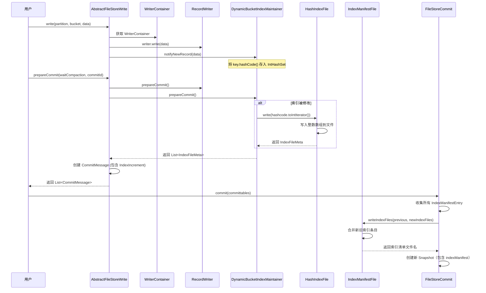
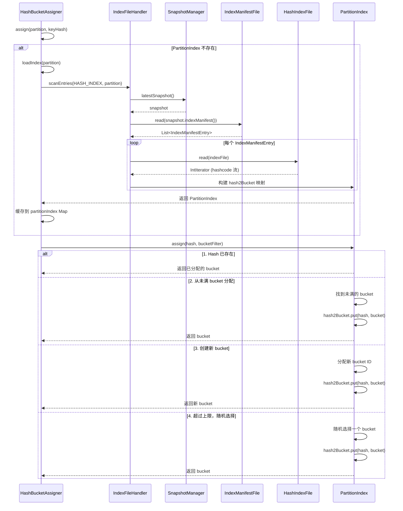
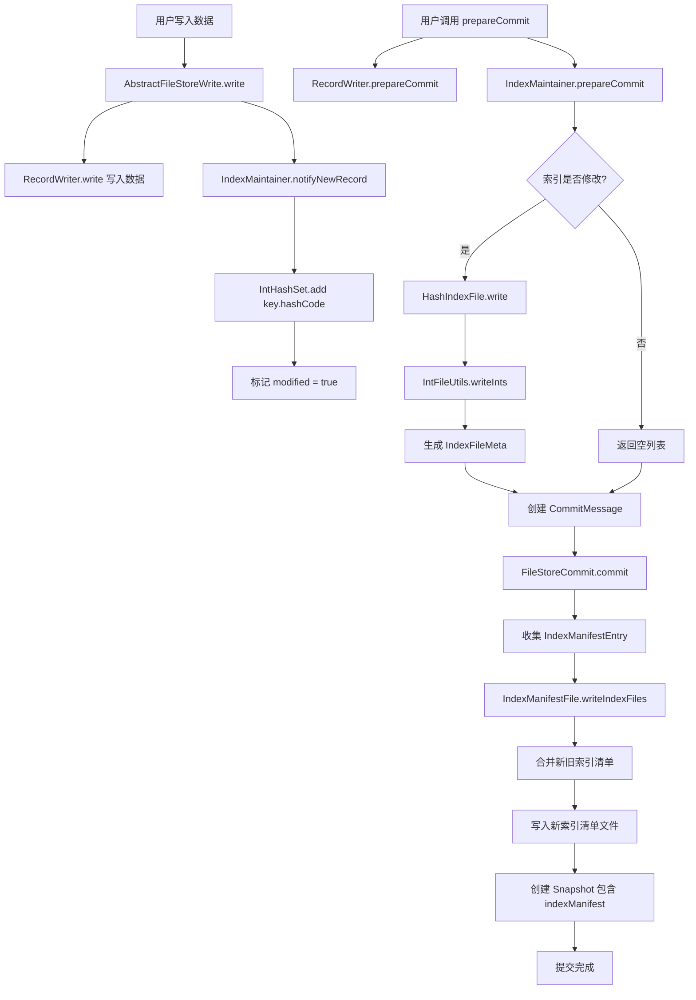
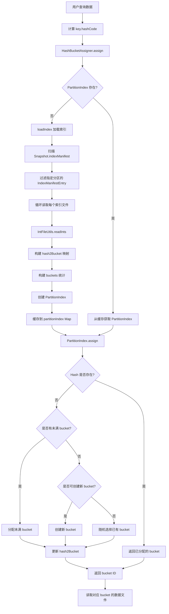
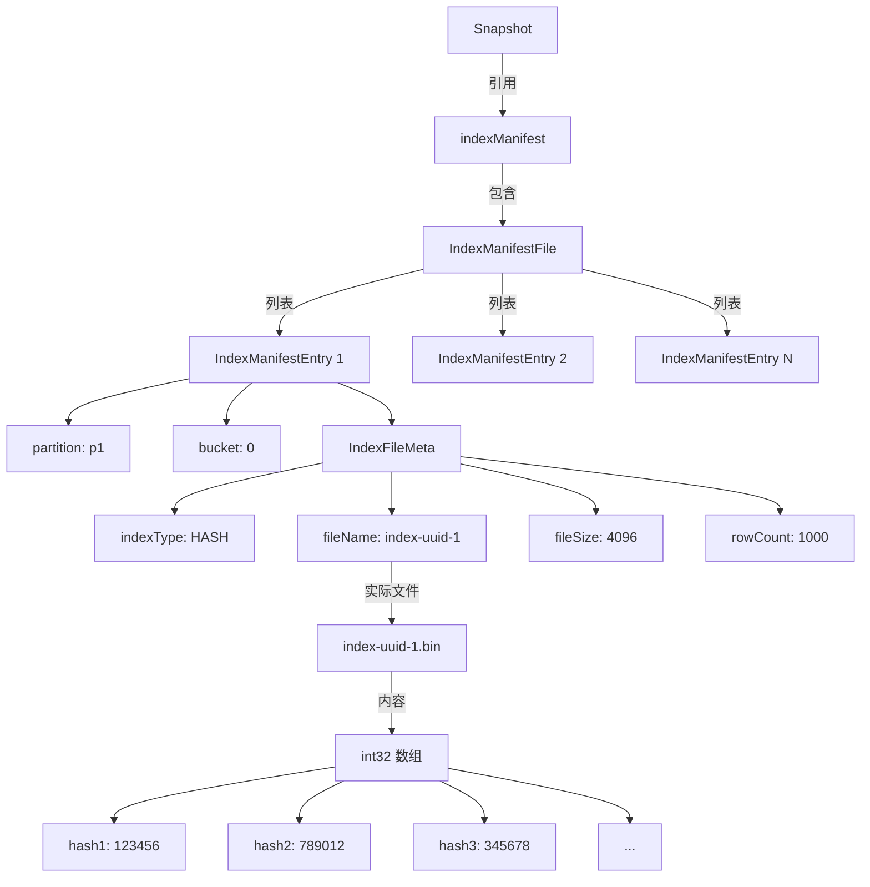

# Paimon Hash 索引实现详细分析

## 1. 概述

Paimon 的 Hash 索引主要用于**动态分桶（Dynamic Bucket）**场景，通过记录主键的 hashcode 与 bucket 的映射关系，实现数据的动态分配和查询。本文以 Hash 索引为例，详细分析 Paimon 索引的实现流程。

## 2. 核心类及其职责

### 2.1 索引文件类

| 类名 | 职责 |
|-----|------|
| `HashIndexFile` | Hash 索引文件的读写操作 |
| `IndexFile` | 索引文件的基类，提供通用的文件操作 |
| `IndexFileMeta` | 索引文件的元数据信息 |
| `IndexPathFactory` | 索引文件路径的生成工厂 |
| `IndexFileHandler` | 索引文件的统一处理器，支持多种索引类型 |

### 2.2 索引维护类

| 类名 | 职责 |
|-----|------|
| `DynamicBucketIndexMaintainer` | 动态分桶的索引维护器，记录每个 bucket 中的 key hashcode |
| `HashBucketAssigner` | Hash 分桶分配器，根据 key hashcode 分配 bucket |
| `PartitionIndex` | 分区级别的索引，维护 hash 到 bucket 的映射关系 |

### 2.3 索引清单类

| 类名 | 职责 |
|-----|------|
| `IndexManifestEntry` | 索引清单条目，记录分区、bucket、索引文件信息 |
| `IndexManifestFile` | 索引清单文件，管理所有索引文件的元数据 |
| `IndexManifestFileHandler` | 索引清单文件的处理器 |

## 3. Hash 索引文件格式

### 3.1 存储格式

Hash 索引文件采用**极其简洁**的二进制格式：

```
+----------+----------+----------+----------+
| int32    | int32    | int32    | ...      |
+----------+----------+----------+----------+
| hash1    | hash2    | hash3    | ...      |
+----------+----------+----------+----------+
```

- **文件内容**：连续存储的 32 位整数（int32）
- **每个整数**：代表一个 key 的 hashcode
- **字节序**：Big-Endian（高字节在前）
- **文件后缀**：通常以索引类型标识

### 3.2 读写实现

**写入实现** (`IntFileUtils.writeInts`):

```java
public static int writeInts(FileIO fileIO, Path path, IntIterator input) throws IOException {
    try (FastBufferedOutputStream out = new FastBufferedOutputStream(fileIO.newOutputStream(path, false));
            IntIterator iterator = input) {
        int count = 0;
        while (true) {
            try {
                writeInt(out, iterator.next());  // 写入4个字节
                count++;
            } catch (EOFException ignored) {
                return count;
            }
        }
    }
}

// 将整数写为4个字节（Big-Endian）
private static void writeInt(FastBufferedOutputStream out, int v) throws IOException {
    out.write((v >>> 24) & 0xFF);  // 最高字节
    out.write((v >>> 16) & 0xFF);
    out.write((v >>> 8) & 0xFF);
    out.write(v & 0xFF);           // 最低字节
}
```

**读取实现** (`IntFileUtils.readInts`):

```java
public static IntIterator readInts(FileIO fileIO, Path path) throws IOException {
    FastBufferedInputStream in = new FastBufferedInputStream(fileIO.newInputStream(path));
    return new IntIterator() {
        @Override
        public int next() throws IOException {
            return readInt(in);  // 读取4个字节
        }
        
        @Override
        public void close() throws IOException {
            in.close();
        }
    };
}

// 从4个字节读取整数（Big-Endian）
private static int readInt(FastBufferedInputStream in) throws IOException {
    int ch1 = in.read();
    int ch2 = in.read();
    int ch3 = in.read();
    int ch4 = in.read();
    if ((ch1 | ch2 | ch3 | ch4) < 0) {
        throw new EOFException();
    }
    return ((ch1 << 24) + (ch2 << 16) + (ch3 << 8) + ch4);
}
```

### 3.3 索引文件元数据

`IndexFileMeta` 包含以下信息：

```java
public class IndexFileMeta {
    private final String indexType;        // 索引类型："HASH"
    private final String fileName;         // 文件名
    private final long fileSize;           // 文件大小（字节）
    private final long rowCount;           // 记录数量（hashcode 数量）
    private final LinkedHashMap<String, DeletionVectorMeta> dvRanges;  // DV索引专用，Hash索引为null
    private final String externalPath;     // 外部路径（可选）
}
```

## 4. 索引写入流程

### 4.1 整体流程图



### 4.2 详细步骤

#### 步骤 1: 数据写入时记录 Hashcode

**时机**：每次调用 `write(partition, bucket, data)` 写入数据时

**位置**：`AbstractFileStoreWrite.write()`

```java
@Override
public void write(BinaryRow partition, int bucket, T data) throws Exception {
    WriterContainer<T> container = getWriterWrapper(partition, bucket);
    // 1. 写入数据到 RecordWriter
    container.writer.write(data);
    
    // 2. 如果启用了动态分桶索引，记录 key 的 hashcode
    if (container.dynamicBucketMaintainer != null) {
        container.dynamicBucketMaintainer.notifyNewRecord((KeyValue) data);
    }
}
```

**索引维护器实现**：`DynamicBucketIndexMaintainer.notifyNewRecord()`

```java
public void notifyNewRecord(KeyValue record) {
    InternalRow key = record.key();
    if (!(key instanceof BinaryRow)) {
        throw new IllegalArgumentException("Unsupported key type: " + key.getClass());
    }
    // 将 key 的 hashcode 添加到 IntHashSet 中
    boolean changed = hashcode.add(key.hashCode());
    if (changed) {
        modified = true;  // 标记索引已修改
    }
}
```

**关键点**：
- 使用 `IntHashSet` 在内存中去重存储 hashcode
- 只记录 `key.hashCode()`，不保存完整的 key
- 通过 `modified` 标记索引是否需要重新写入

#### 步骤 2: PrepareCommit 时写入索引文件

**时机**：调用 `prepareCommit()` 准备提交时

**位置**：`AbstractFileStoreWrite.prepareCommit()`

```java
@Override
public List<CommitMessage> prepareCommit(boolean waitCompaction, long commitIdentifier) {
    List<CommitMessage> result = new ArrayList<>();
    
    for (Map.Entry<BinaryRow, Map<Integer, WriterContainer<T>>> partEntry : writers.entrySet()) {
        BinaryRow partition = partEntry.getKey();
        for (Map.Entry<Integer, WriterContainer<T>> entry : partEntry.getValue().entrySet()) {
            int bucket = entry.getKey();
            WriterContainer<T> writerContainer = entry.getValue();
            
            // 1. 准备提交数据文件
            CommitIncrement increment = writerContainer.writer.prepareCommit(waitCompaction);
            
            // 2. 准备提交索引文件
            List<IndexFileMeta> newIndexFiles = new ArrayList<>();
            if (writerContainer.dynamicBucketMaintainer != null) {
                newIndexFiles.addAll(writerContainer.dynamicBucketMaintainer.prepareCommit());
            }
            
            // 3. 创建 CommitMessage
            CommitMessageImpl committable = new CommitMessageImpl(
                partition,
                bucket,
                writerContainer.totalBuckets,
                increment.newFilesIncrement(),
                increment.compactIncrement(),
                new IndexIncrement(newIndexFiles)  // 包含索引增量
            );
            result.add(committable);
        }
    }
    return result;
}
```

**索引维护器实现**：`DynamicBucketIndexMaintainer.prepareCommit()`

```java
public List<IndexFileMeta> prepareCommit() {
    if (modified) {
        IndexFileMeta entry;
        try {
            // 将 IntHashSet 中的所有 hashcode 写入文件
            entry = indexFile.write(hashcode.toIntIterator());
        } catch (IOException e) {
            throw new RuntimeException(e);
        }
        modified = false;  // 重置修改标记
        return Collections.singletonList(entry);
    }
    return Collections.emptyList();  // 未修改，返回空列表
}
```

**HashIndexFile 写入实现**：

```java
public IndexFileMeta write(IntIterator input) throws IOException {
    // 1. 生成新的索引文件路径
    Path path = pathFactory.newPath();
    
    // 2. 将整数迭代器写入文件
    int count = writeInts(fileIO, path, input);
    
    // 3. 创建索引文件元数据
    return new IndexFileMeta(
        HASH_INDEX,                    // 索引类型："HASH"
        path.getName(),                // 文件名
        fileSize(path),                // 文件大小
        count,                         // hashcode 数量
        null,                          // DV ranges（Hash索引不用）
        isExternalPath() ? path.toString() : null  // 外部路径
    );
}
```

#### 步骤 3: Commit 时写入索引清单

**时机**：调用 `FileStoreCommit.commit()` 提交时

**位置**：`FileStoreCommitImpl.commit()`

```java
@Override
public int commit(ManifestCommittable committable, boolean checkAppendFiles) {
    List<IndexManifestEntry> appendHashIndexFiles = new ArrayList<>();
    List<IndexManifestEntry> compactDvIndexFiles = new ArrayList<>();
    
    // 1. 收集所有索引文件增量
    collectChanges(
        committable.fileCommittables(),
        appendTableFiles,
        appendChangelog,
        compactTableFiles,
        compactChangelog,
        appendHashIndexFiles,      // 收集 Hash 索引
        compactDvIndexFiles        // 收集 DV 索引
    );
    
    // 2. 写入索引清单文件
    String oldIndexManifest = latestSnapshot != null ? latestSnapshot.indexManifest() : null;
    List<IndexManifestEntry> indexFiles = new ArrayList<>();
    indexFiles.addAll(appendHashIndexFiles);
    indexFiles.addAll(compactDvIndexFiles);
    
    String indexManifest = indexManifestFile.writeIndexFiles(
        oldIndexManifest,
        indexFiles,
        bucketMode
    );
    
    // 3. 创建新的 Snapshot，包含 indexManifest 引用
    Snapshot newSnapshot = new Snapshot(
        newSnapshotId,
        schemaId,
        baseManifestList,
        deltaManifestList,
        changelogManifestList,
        indexManifest,  // 索引清单文件名
        ...
    );
}
```

**收集索引增量**：`collectChanges()`

```java
private void collectChanges(..., List<IndexManifestEntry> appendHashIndexFiles, ...) {
    for (CommitMessage commitMessage : commitMessages) {
        commitMessage.indexIncrement().newIndexFiles().forEach(f -> {
            switch (f.indexType()) {
                case HASH_INDEX:
                    appendHashIndexFiles.add(
                        new IndexManifestEntry(
                            FileKind.ADD,                // 添加操作
                            commitMessage.partition(),   // 分区
                            commitMessage.bucket(),      // bucket
                            f                            // IndexFileMeta
                        )
                    );
                    break;
                case DELETION_VECTORS_INDEX:
                    compactDvIndexFiles.add(...);
                    break;
            }
        });
    }
}
```

**索引清单写入**：`IndexManifestFile.writeIndexFiles()`

```java
public String writeIndexFiles(
        String previousIndexManifest,
        List<IndexManifestEntry> newIndexFiles,
        BucketMode bucketMode) {
    if (newIndexFiles.isEmpty()) {
        return previousIndexManifest;  // 无新索引，返回旧清单
    }
    
    IndexManifestFileHandler handler = new IndexManifestFileHandler(this, bucketMode);
    return handler.write(previousIndexManifest, newIndexFiles);
}
```

**清单合并逻辑**：`IndexManifestFileHandler.write()`

```java
String write(String previousIndexManifest, List<IndexManifestEntry> newIndexFiles) {
    // 1. 读取旧的索引清单
    List<IndexManifestEntry> entries = previousIndexManifest == null
        ? new ArrayList<>()
        : indexManifestFile.read(previousIndexManifest);
    
    // 2. 分离 Hash 索引和 DV 索引
    Pair<List<IndexManifestEntry>, List<IndexManifestEntry>> previous = separateIndexEntries(entries);
    Pair<List<IndexManifestEntry>, List<IndexManifestEntry>> current = separateIndexEntries(newIndexFiles);
    
    // 3. 合并 Hash 索引（使用特定策略）
    List<IndexManifestEntry> indexEntries = 
        getIndexManifestFileCombine(HASH_INDEX).combine(previous.getLeft(), current.getLeft());
    
    // 4. 合并 DV 索引
    indexEntries.addAll(
        getIndexManifestFileCombine(DELETION_VECTORS_INDEX).combine(previous.getRight(), current.getRight())
    );
    
    // 5. 写入新的索引清单文件
    return indexManifestFile.writeWithoutRolling(indexEntries);
}
```

### 4.3 索引文件路径

索引文件存储在表目录下的特定路径：

```
table_path/
  ├── bucket-{bucket}/
  │   ├── index/
  │   │   ├── index-{uuid}           # Hash 索引文件
  │   │   └── ...
  │   └── data files...
  ├── index-manifest-{uuid}          # 索引清单文件
  └── snapshot/
      └── snapshot-{id}              # 快照文件（包含 indexManifest 引用）
```

## 5. 索引查询流程

### 5.1 整体流程图



### 5.2 详细步骤

#### 步骤 1: 分配 Bucket

**入口**：`HashBucketAssigner.assign()`

```java
public int assign(BinaryRow partition, int hash) {
    int partitionHash = partition.hashCode();
    int recordAssignId = computeAssignId(partitionHash, hash);
    
    // 验证是否属于当前 Assigner
    checkArgument(recordAssignId == assignId, "...");
    
    // 1. 获取或加载分区索引
    PartitionIndex index = this.partitionIndex.get(partition);
    if (index == null) {
        partition = partition.copy();
        index = loadIndex(partition, partitionHash);
        this.partitionIndex.put(partition, index);  // 缓存
    }
    
    // 2. 从分区索引中分配 bucket
    int assigned = index.assign(hash, this::isMyBucket, maxBucketsNum, maxBucketId);
    
    if (LOG.isDebugEnabled()) {
        LOG.debug("Assign {} to the partition {} key hash {}", assigned, partition, hash);
    }
    
    // 3. 更新最大 bucket ID
    if (assigned > maxBucketId) {
        maxBucketId = assigned;
    }
    
    return assigned;
}
```

#### 步骤 2: 加载分区索引

**实现**：`PartitionIndex.loadIndex()`

```java
public static PartitionIndex loadIndex(
        IndexFileHandler indexFileHandler,
        BinaryRow partition,
        long targetBucketRowNumber,
        IntPredicate loadFilter,
        IntPredicate bucketFilter) {
    
    // 1. 扫描指定分区的所有 Hash 索引文件
    List<IndexManifestEntry> files = indexFileHandler.scanEntries(HASH_INDEX, partition);
    
    // 2. 构建 hash 到 bucket 的映射
    Int2ShortHashMap.Builder mapBuilder = Int2ShortHashMap.builder();
    Map<Integer, Long> buckets = new HashMap<>();  // bucket -> 行数
    
    for (IndexManifestEntry file : files) {
        // 3. 读取每个索引文件
        try (IntIterator iterator = indexFileHandler
                .hashIndex(file.partition(), file.bucket())
                .read(file.indexFile())) {
            
            while (true) {
                try {
                    int hash = iterator.next();  // 读取一个 hashcode
                    
                    // 4. 如果 hash 属于当前 Assigner，加入映射
                    if (loadFilter.test(hash)) {
                        mapBuilder.put(hash, (short) file.bucket());
                    }
                    
                    // 5. 统计每个 bucket 的行数
                    if (bucketFilter.test(file.bucket())) {
                        buckets.compute(file.bucket(), 
                            (bucket, number) -> number == null ? 1 : number + 1);
                    }
                } catch (EOFException ignored) {
                    break;  // 文件读取完毕
                }
            }
        } catch (IOException e) {
            throw new UncheckedIOException(e);
        }
    }
    
    // 6. 创建分区索引
    return new PartitionIndex(mapBuilder.build(), buckets, targetBucketRowNumber);
}
```

**扫描索引文件**：`IndexFileHandler.scanEntries()`

```java
public List<IndexManifestEntry> scanEntries(
        Snapshot snapshot, String indexType, BinaryRow partition) {
    
    // 1. 获取索引清单文件名
    if (snapshot == null || snapshot.indexManifest() == null) {
        return Collections.emptyList();
    }
    String indexManifest = snapshot.indexManifest();
    
    // 2. 读取索引清单
    List<IndexManifestEntry> manifestEntries = indexManifestFile.read(indexManifest);
    
    // 3. 过滤指定类型和分区的索引
    List<IndexManifestEntry> result = new ArrayList<>();
    for (IndexManifestEntry file : manifestEntries) {
        if (file.indexFile().indexType().equals(indexType) 
                && partition.equals(file.partition())) {
            result.add(file);
        }
    }
    return result;
}
```

#### 步骤 3: Bucket 分配策略

**实现**：`PartitionIndex.assign()`

```java
public int assign(int hash, IntPredicate bucketFilter, int maxBucketsNum, int maxBucketId) {
    accessed = true;
    
    // 策略 1: Hash 已存在，直接返回已分配的 bucket
    if (hash2Bucket.containsKey(hash)) {
        return hash2Bucket.get(hash);
    }
    
    // 策略 2: 从现有未满的 bucket 中分配
    Iterator<Map.Entry<Integer, Long>> iterator = nonFullBucketInformation.entrySet().iterator();
    while (iterator.hasNext()) {
        Map.Entry<Integer, Long> entry = iterator.next();
        Integer bucket = entry.getKey();
        Long number = entry.getValue();
        
        if (number < targetBucketRowNumber) {  // bucket 未满
            entry.setValue(number + 1);  // 增加行数
            hash2Bucket.put(hash, (short) bucket.intValue());
            return bucket;
        } else {
            iterator.remove();  // bucket 已满，移除
        }
    }
    
    // 策略 3: 创建新 bucket
    int globalMaxBucketId = (maxBucketsNum == -1 ? Short.MAX_VALUE : maxBucketsNum) - 1;
    if (totalBucketSet.isEmpty() || maxBucketId < globalMaxBucketId) {
        for (int i = 0; i <= globalMaxBucketId; i++) {
            if (bucketFilter.test(i) && !totalBucketSet.contains(i)) {
                nonFullBucketInformation.put(i, 1L);
                totalBucketSet.add(i);
                totalBucketArray.add(i);
                hash2Bucket.put(hash, (short) i);
                return i;
            }
        }
        if (-1 == maxBucketsNum) {
            throw new RuntimeException(
                String.format("Too more bucket %s, you should increase target bucket row number %s.",
                    maxBucketId, targetBucketRowNumber));
        }
    }
    
    // 策略 4: 超过 bucket 上限，随机选择一个已有的 bucket
    int bucket = ListUtils.pickRandomly(totalBucketArray);
    hash2Bucket.put(hash, (short) bucket);
    return bucket;
}
```

**分配策略总结**：

1. **已存在策略**：如果 hash 已经分配过 bucket，直接返回（保证数据一致性）
2. **未满 bucket 策略**：优先使用未达到 `targetBucketRowNumber` 的 bucket
3. **新建 bucket 策略**：如果所有 bucket 都满了且未达到 `maxBucketsNum`，创建新 bucket
4. **随机分配策略**：如果达到 bucket 上限，随机选择一个已有 bucket（允许 bucket 超过目标行数）

## 6. 数据结构设计

### 6.1 PartitionIndex 内存结构

```java
public class PartitionIndex {
    // Hash 到 Bucket 的映射（核心数据结构）
    public final Int2ShortHashMap hash2Bucket;  // hash -> bucket (short 类型，节省内存)
    
    // 未满的 Bucket 信息
    public final Map<Integer, Long> nonFullBucketInformation;  // bucket -> 当前行数
    
    // 所有 Bucket 集合
    public final Set<Integer> totalBucketSet;      // 用于快速判断 bucket 是否存在
    public final List<Integer> totalBucketArray;   // 用于随机选择
    
    // 配置参数
    private final long targetBucketRowNumber;  // 目标每个 bucket 的行数
    
    // 访问标记（用于缓存清理）
    public boolean accessed;
    public long lastAccessedCommitIdentifier;
}
```

**设计亮点**：

1. **内存优化**：使用 `Int2ShortHashMap` 将 bucket 存储为 `short` 类型（2字节），而不是 `int`（4字节），节省 50% 内存
2. **快速查找**：`hash2Bucket` 提供 O(1) 的查找性能
3. **未满追踪**：`nonFullBucketInformation` 只保留未满的 bucket，减少遍历开销
4. **双重存储**：`totalBucketSet` 用于快速判断，`totalBucketArray` 用于随机选择

### 6.2 DynamicBucketIndexMaintainer 内存结构

```java
public class DynamicBucketIndexMaintainer {
    private final HashIndexFile indexFile;     // 索引文件读写器
    private final IntHashSet hashcode;         // 存储所有 key 的 hashcode
    private boolean modified;                  // 是否被修改过
}
```

**设计亮点**：

1. **去重存储**：使用 `IntHashSet` 自动去重，避免重复写入相同的 hashcode
2. **延迟写入**：只在 `prepareCommit()` 时才写入文件，批量提交
3. **增量标记**：通过 `modified` 标记避免不必要的文件写入

### 6.3 IndexManifestEntry 结构

```java
public class IndexManifestEntry {
    private final FileKind kind;          // ADD 或 DELETE
    private final BinaryRow partition;    // 分区
    private final int bucket;             // Bucket
    private final IndexFileMeta indexFile;  // 索引文件元数据
}
```

**关联关系**：

```
Snapshot
  └── indexManifest (文件名)
        └── List<IndexManifestEntry>
              ├── partition: 分区1
              │   ├── bucket: 0
              │   │   └── IndexFileMeta (hash-index-001.bin)
              │   └── bucket: 1
              │       └── IndexFileMeta (hash-index-002.bin)
              └── partition: 分区2
                  └── ...
```

## 7. 完整示例：插入数据并查询

### 7.1 场景描述

假设我们有一个动态分桶表，配置如下：

- `bucket.mode = HASH_DYNAMIC`
- `dynamic-bucket.target-row-num = 1000`（每个 bucket 目标 1000 行）
- `dynamic-bucket.assigner-parallelism = 2`（2 个 Assigner）

### 7.2 插入流程示例

**第一次插入** (key1, value1):

```
1. 计算 hash = key1.hashCode() = 123456
2. HashBucketAssigner.assign(partition, 123456)
   - 分区索引不存在，加载索引（首次为空）
   - PartitionIndex.assign(123456, ...)
     - hash 不存在 -> 创建新 bucket = 0
     - hash2Bucket.put(123456, 0)
     - nonFullBucketInformation.put(0, 1)  // bucket 0 有 1 行
3. write(partition, bucket=0, data)
   - RecordWriter.write(data)
   - DynamicBucketIndexMaintainer.notifyNewRecord(data)
     - hashcode.add(123456)  // 记录 hashcode
     - modified = true
```

**第二次插入** (key1, value2) - 相同 key:

```
1. 计算 hash = key1.hashCode() = 123456
2. HashBucketAssigner.assign(partition, 123456)
   - 分区索引已存在
   - PartitionIndex.assign(123456, ...)
     - hash2Bucket.containsKey(123456) = true
     - 返回 bucket = 0  // 相同 key 分配到相同 bucket
3. write(partition, bucket=0, data)
   - DynamicBucketIndexMaintainer.notifyNewRecord(data)
     - hashcode.add(123456)  // 已存在，不添加
     - modified 保持 false（未改变）
```

**第三次插入** (key2, value3) - 不同 key:

```
1. 计算 hash = key2.hashCode() = 789012
2. HashBucketAssigner.assign(partition, 789012)
   - PartitionIndex.assign(789012, ...)
     - hash 不存在
     - bucket 0 未满（1 < 1000） -> 分配 bucket = 0
     - hash2Bucket.put(789012, 0)
     - nonFullBucketInformation.put(0, 2)  // bucket 0 有 2 行
3. write(partition, bucket=0, data)
   - DynamicBucketIndexMaintainer.notifyNewRecord(data)
     - hashcode.add(789012)  // 添加新 hashcode
     - modified = true
```

**插入第 1001 条记录** (bucket 0 已满):

```
1. 计算 hash = key1001.hashCode() = 111222
2. HashBucketAssigner.assign(partition, 111222)
   - PartitionIndex.assign(111222, ...)
     - hash 不存在
     - bucket 0 已满（1000 >= 1000） -> 从 nonFullBucketInformation 移除
     - 创建新 bucket = 1
     - hash2Bucket.put(111222, 1)
     - nonFullBucketInformation.put(1, 1)  // bucket 1 有 1 行
3. write(partition, bucket=1, data)
   - 创建新的 WriterContainer 和 DynamicBucketIndexMaintainer
   - notifyNewRecord() 将 111222 加入新的 hashcode set
```

### 7.3 Commit 流程示例

**PrepareCommit**:

```
1. prepareCommit(waitCompaction=false, commitId=1)
   
2. 对于 bucket 0:
   - WriterContainer.dynamicBucketMaintainer.prepareCommit()
     - hashcode 包含: [123456, 789012, ...]
     - 写入文件: index/index-uuid-1.bin
     - 返回 IndexFileMeta(type=HASH, file=index-uuid-1.bin, count=1000)
   
3. 对于 bucket 1:
   - WriterContainer.dynamicBucketMaintainer.prepareCommit()
     - hashcode 包含: [111222]
     - 写入文件: index/index-uuid-2.bin
     - 返回 IndexFileMeta(type=HASH, file=index-uuid-2.bin, count=1)
   
4. 返回 CommitMessage:
   - partition: partition1
   - bucket: 0
   - indexIncrement: [IndexFileMeta(index-uuid-1.bin)]
   
   - partition: partition1
   - bucket: 1
   - indexIncrement: [IndexFileMeta(index-uuid-2.bin)]
```

**Commit**:

```
1. FileStoreCommit.commit(committables)
   
2. collectChanges():
   - appendHashIndexFiles.add(
       IndexManifestEntry(ADD, partition1, 0, IndexFileMeta(index-uuid-1.bin))
     )
   - appendHashIndexFiles.add(
       IndexManifestEntry(ADD, partition1, 1, IndexFileMeta(index-uuid-2.bin))
     )
   
3. IndexManifestFile.writeIndexFiles():
   - 合并新旧索引清单
   - 写入: index-manifest-list-uuid-1
   
4. 创建 Snapshot-1:
   {
     "id": 1,
     "schemaId": 0,
     "baseManifestList": "manifest-list-uuid-1",
     "deltaManifestList": "manifest-list-uuid-2",
     "changelogManifestList": null,
     "indexManifest": "index-manifest-list-uuid-1",  // 索引清单
     "commitUser": "user1",
     "commitIdentifier": 1,
     ...
   }
```

### 7.4 查询流程示例

**查询 key1**:

```
1. HashBucketAssigner.assign(partition, key1.hashCode()=123456)
   
2. 加载分区索引（如果不存在）:
   - 读取 Snapshot-1 的 indexManifest
   - 扫描所有 IndexManifestEntry:
     - Entry1: partition1, bucket 0, file=index-uuid-1.bin
     - Entry2: partition1, bucket 1, file=index-uuid-2.bin
   
3. 读取 index-uuid-1.bin:
   - IntIterator: [123456, 789012, ...]
   - 构建 hash2Bucket: {123456 -> 0, 789012 -> 0, ...}
   
4. 读取 index-uuid-2.bin:
   - IntIterator: [111222]
   - 更新 hash2Bucket: {123456 -> 0, 789012 -> 0, ..., 111222 -> 1}
   
5. 查询 hash2Bucket:
   - hash2Bucket.get(123456) = 0
   - 返回 bucket = 0
   
6. 读取数据:
   - 只需要扫描 partition1/bucket-0/ 的数据文件
   - 不需要扫描 bucket-1（显著提升查询性能）
```

## 8. 索引维护与生命周期

### 8.1 索引缓存清理

**PartitionIndex 缓存清理**：

```java
// HashBucketAssigner.prepareCommit()
@Override
public void prepareCommit(long commitIdentifier) {
    long latestCommittedIdentifier = snapshotManager
        .latestSnapshotOfUserFromFilesystem(commitUser)
        .map(Snapshot::commitIdentifier)
        .orElse(Long.MIN_VALUE);
    
    Iterator<Map.Entry<BinaryRow, PartitionIndex>> iterator = partitionIndex.entrySet().iterator();
    while (iterator.hasNext()) {
        Map.Entry<BinaryRow, PartitionIndex> entry = iterator.next();
        PartitionIndex index = entry.getValue();
        
        if (index.accessed) {
            // 分区被访问过，更新最后访问的 commit ID
            index.lastAccessedCommitIdentifier = commitIdentifier;
        } else {
            // 分区未被访问
            if (index.lastAccessedCommitIdentifier <= latestCommittedIdentifier) {
                // 且上次访问已提交，清理该分区索引
                iterator.remove();
            }
        }
        index.accessed = false;  // 重置访问标记
    }
}
```

**清理策略**：

1. 每次 `prepareCommit` 时检查所有缓存的分区索引
2. 如果分区在本次 commit 中未被访问，且上次访问已经提交，则清理
3. 避免内存中积累过多不再使用的分区索引（例如昨天的分区）

### 8.2 索引文件合并

**IndexManifestFileHandler 合并策略**：

对于 **HASH_DYNAMIC** 模式：

```java
// 每个 (partition, bucket) 只保留最新的索引文件
private IndexManifestFileCombine getIndexManifestFileCombine(String indexType) {
    if (indexType.equals(HASH_INDEX) && bucketMode == BucketMode.HASH_DYNAMIC) {
        // 动态分桶：每个 bucket 只保留一个索引文件
        return (previous, current) -> {
            Map<Pair<BinaryRow, Integer>, IndexManifestEntry> map = new HashMap<>();
            
            // 先加入旧的
            for (IndexManifestEntry entry : previous) {
                map.put(Pair.of(entry.partition(), entry.bucket()), entry);
            }
            
            // 新的覆盖旧的
            for (IndexManifestEntry entry : current) {
                map.put(Pair.of(entry.partition(), entry.bucket()), entry);
            }
            
            return new ArrayList<>(map.values());
        };
    }
    // 其他模式：累积所有索引文件
    return (previous, current) -> {
        List<IndexManifestEntry> result = new ArrayList<>(previous);
        result.addAll(current);
        return result;
    };
}
```

**合并原因**：

- 动态分桶模式下，每次 commit 都会重写整个 bucket 的索引
- 旧索引文件不再需要，只保留最新的索引文件
- 减少索引清单的大小，提升读取性能

### 8.3 索引文件清理

索引文件的清理由 **Snapshot Expiration** 机制处理：

1. 当 Snapshot 过期时，读取其 `indexManifest`
2. 标记所有引用的索引文件
3. 删除未被任何有效 Snapshot 引用的索引文件

## 9. 性能优化

### 9.1 内存优化

| 优化点 | 实现 | 收益 |
|--------|------|------|
| Short 存储 Bucket | `Int2ShortHashMap` 将 bucket 存储为 `short` | 节省 50% 内存 |
| HashSet 去重 | `IntHashSet` 自动去重 hashcode | 减少索引文件大小 |
| 未满 Bucket 追踪 | 只保留未满的 bucket 信息 | 减少遍历开销 |
| 分区索引缓存清理 | 自动清理未访问的分区索引 | 避免内存泄漏 |

### 9.2 I/O 优化

| 优化点 | 实现 | 收益 |
|--------|------|------|
| 批量写入 | `prepareCommit()` 时批量写入所有 hashcode | 减少文件操作次数 |
| 延迟写入 | 只在索引修改时才写入文件 | 避免不必要的 I/O |
| Fast Buffered I/O | 使用 `FastBufferedInputStream/OutputStream` | 提升读写性能 |
| 增量索引 | 只写入变更的索引，而非全量 | 减少数据传输量 |

### 9.3 查询优化

| 优化点 | 实现 | 收益 |
|--------|------|------|
| O(1) Hash 查找 | `Int2ShortHashMap` 提供常数时间查找 | 快速定位 bucket |
| 分区索引缓存 | 缓存已加载的分区索引 | 避免重复加载 |
| 索引文件合并 | 每个 bucket 只保留最新索引 | 减少扫描文件数量 |
| 按需加载 | 只加载需要的分区索引 | 减少启动开销 |

## 10. 流程图总结

### 10.1 索引写入完整流程



### 10.2 索引查询完整流程



### 10.3 索引文件组织结构



## 11. 关键配置参数

| 配置项 | 默认值 | 说明 |
|--------|--------|------|
| `bucket` | - | 分桶模式：`hash-fixed`、`hash-dynamic`、`cross-partition`、`unaware` |
| `dynamic-bucket.target-row-num` | 2000000 | 每个 bucket 的目标行数 |
| `dynamic-bucket.max-buckets` | 0 (无限制) | 最大 bucket 数量 |
| `dynamic-bucket.assigner-parallelism` | - | Bucket Assigner 的并行度 |

## 12. 总结

### 12.1 Hash 索引的优势

1. **极简格式**：索引文件只存储 int32 数组，无额外开销
2. **快速查找**：O(1) 时间复杂度定位 bucket
3. **内存高效**：使用 `Int2ShortHashMap` 优化内存使用
4. **增量更新**：只在索引变更时写入文件
5. **自动清理**：通过 Snapshot Expiration 自动清理过期索引

### 12.2 适用场景

- **动态分桶表**：数据量不可预测，需要自动扩展 bucket
- **高基数主键**：主键种类繁多，难以提前规划 bucket 数量
- **流式写入**：持续写入新数据，需要动态分配 bucket

### 12.3 局限性

1. **仅记录 Hashcode**：不保存完整 key，存在 hash 冲突风险（概率极低）
2. **全量重写**：每次 commit 都会重写整个 bucket 的索引文件（对于大 bucket 可能有开销）
3. **内存占用**：需要将整个分区的 hash 映射加载到内存（对于超大分区可能有压力）

### 12.4 最佳实践

1. **合理设置 target-row-num**：根据数据量和查询模式调整，避免 bucket 过多或过少
2. **控制分区大小**：避免单个分区过大导致索引加载缓慢
3. **监控 bucket 数量**：通过 `max-buckets` 限制 bucket 数量，防止无限增长
4. **定期 Compaction**：合并小文件，优化索引文件大小

---

**文档版本**: v1.0  
**适用 Paimon 版本**: 0.9.0+  
**最后更新**: 2025-01-15

