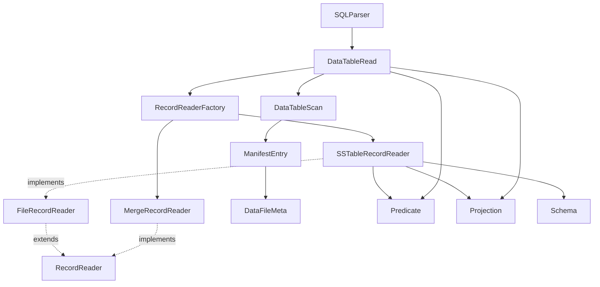
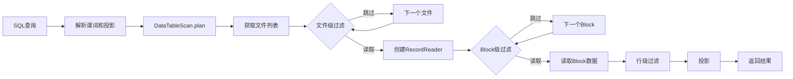
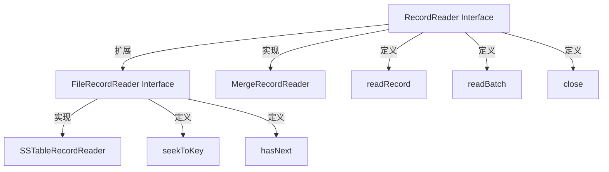
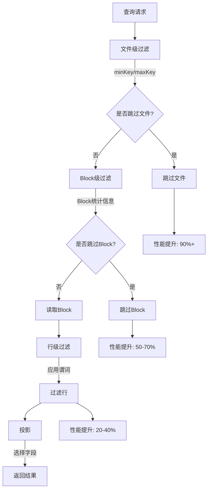
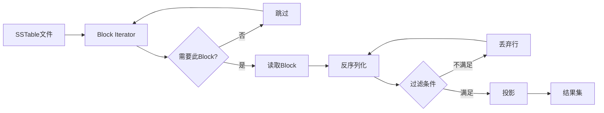

# RecordReader 架构类图

## 核心类关系

## 读取流程

## 接口设计

## 优化层次

## 数据流

## 类职责划分

### DataTableRead
- 文件级过滤（基于 DataFileMeta）
- 协调多个 FileRecordReader
- 支持批量和流式读取

### RecordReaderFactory
- 创建和配置 RecordReader
- 下推谓词和投影
- 封装 Reader 创建复杂性

### SSTableRecordReader
- Block 级懒加载
- Block 级过滤
- 行级过滤和投影
- 支持范围扫描

### MergeRecordReader
- 合并多个有序 Reader
- 保证结果有序性
- 用于多层 SSTable 合并读取
